# 第三組
# 專案主題：天氣穿搭系統

| 第三組|
|:--------------|
|C108118226 羅鈺凱|
|C108118229 林奎似 (組長)|
|C108118230 宋彥廷|
|C108118236 白皓尹|

# 分工

| 第三組||
|:----------------|:--------------:|
|C108118226 羅鈺凱| 資料蒐集、程式開發|
|C108118229 林奎似| 建立資料庫、程式開發|
|C108118230 宋彥廷| 建立資料庫、程式開發|
|C108118236 白皓尹| 資料蒐集、撰寫使用者說明|

# 內容
天氣預報系統以及依照天氣提供穿搭的建議

# 甘特圖

# PERT圖

## 功能性需求
### 1.提供天氣資訊
### 2.給予穿搭意見
### 3.上傳自己的衣著
### 4.按照溫度推薦不同衣服

## 非功能性需求
### 1.反應時間(response time) ：載入時間快。
### 2.使用性(usability)：資訊都來自政府的公開資料平台，準確性高。
### 3.可靠度(reliability)：系統可24小時上線。
### 4.效能(performance)：採用多執行緒，能承載100人同時使用App。
### 5.維護性(maintainability)：主要採用Android Studio進行開發。

# 使用案例說明

| 使用案例名稱| 查詢天氣|
|:----------------|:--------------|
|行動者| 使用者|
|說明| 查詢當天即天氣預報|
|完成動作| 使用者開啟程式即可查看|
|替代方法| 無|
|先決條件| 使用者須先開啟定位系統|
|後置條件| 每日可查看|
|假設| 無|

| 使用案例名稱| 穿搭搭配|
|:----------------|:--------------|
|行動者| 使用者|
|說明| 查詢穿搭搭配|
|完成動作| 使用者點選穿搭建議按鈕即可查看|
|替代方法| 無|
|先決條件| 使用者須先登入會員後建置衣櫃|
|後置條件| 每日可查看|
|假設| 無|

| 使用案例名稱| 建立穿搭|
|:----------------|:--------------|
|行動者| 使用者|
|說明| 建立穿搭資料庫|
|完成動作| 使用者點選穿搭建議按鈕即可查看|
|替代方法| 無|
|先決條件| 使用者須先登入會員|
|後置條件| 每日可查看|
|假設| 無|

## 使用案例圖（Use Case Diagram）
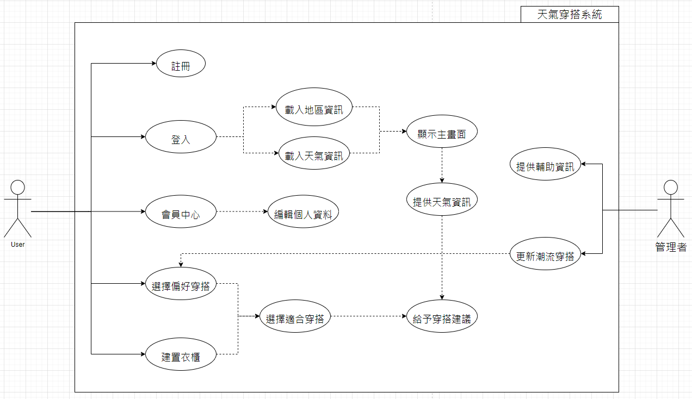

## DFD圖
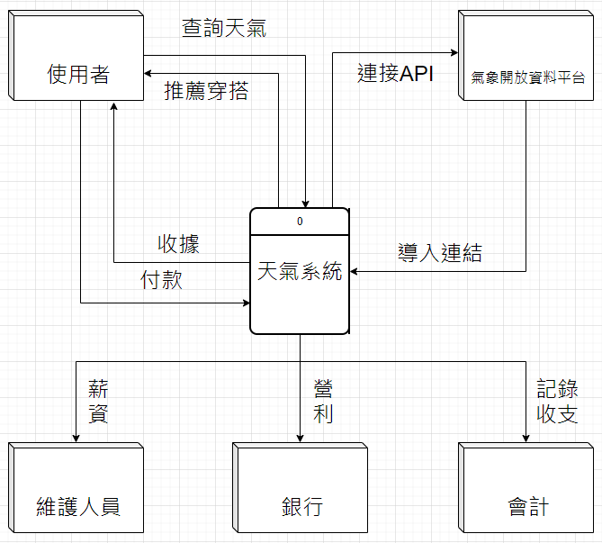

## DFD 0 圖
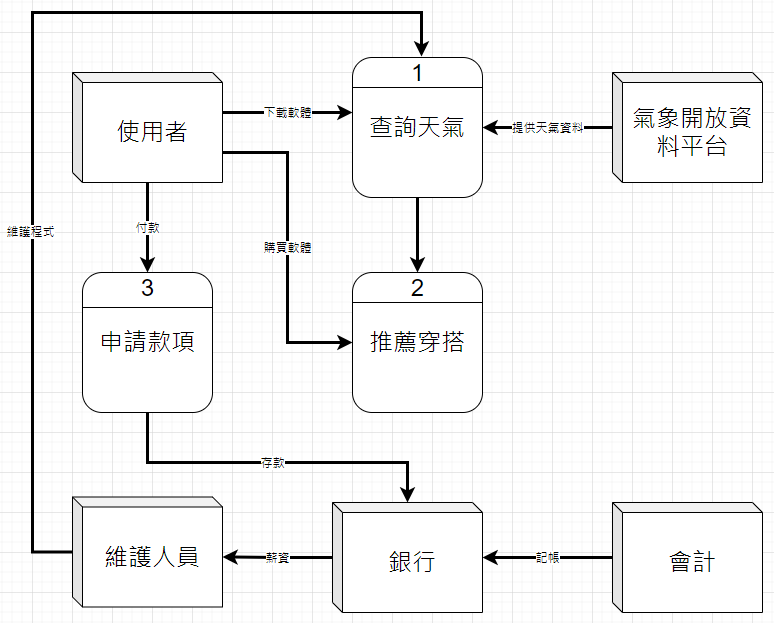

## FDD圖
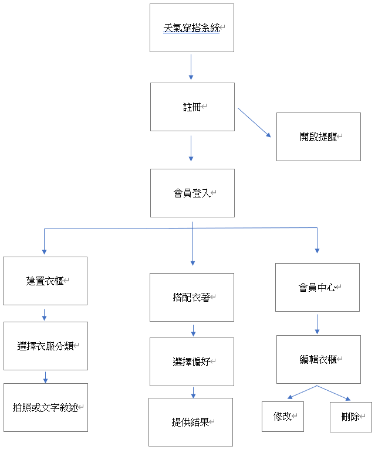

## 類別圖
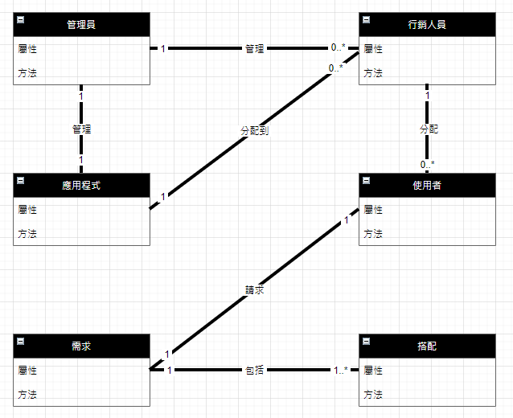

## 循序圖
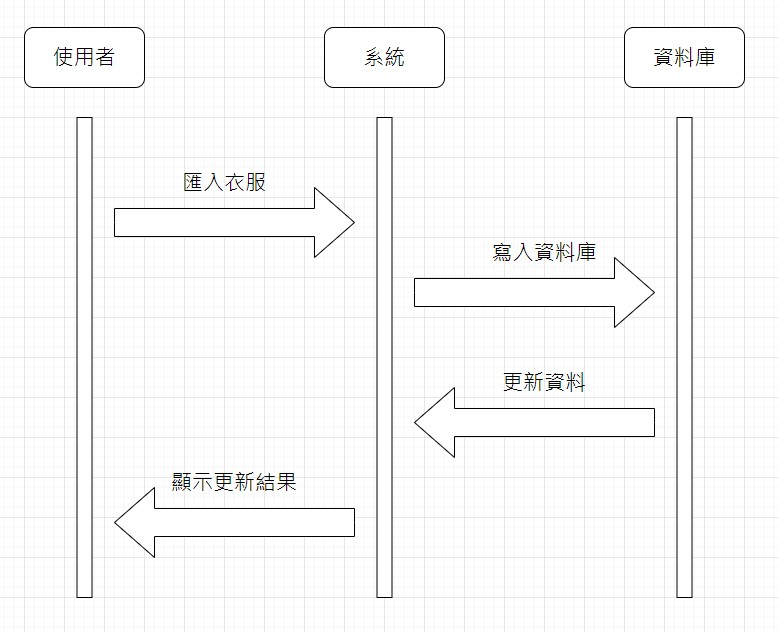
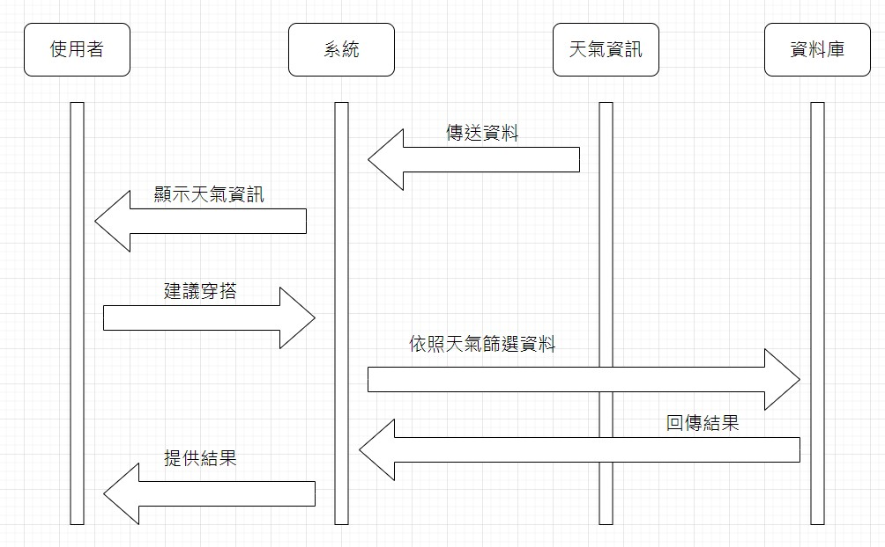

## 螢幕設計圖
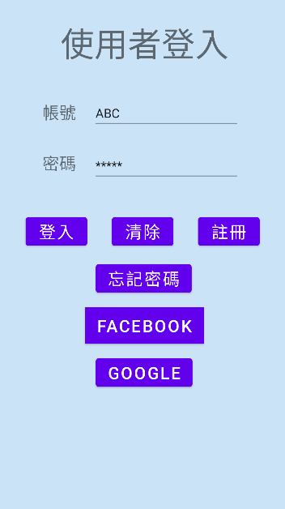
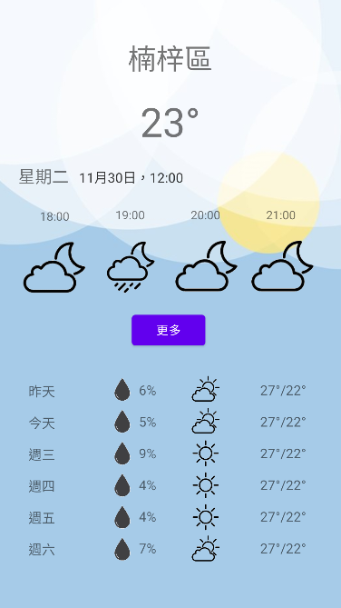
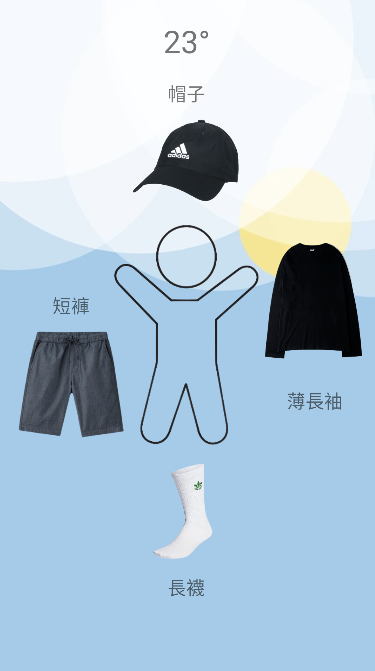

## ERD圖
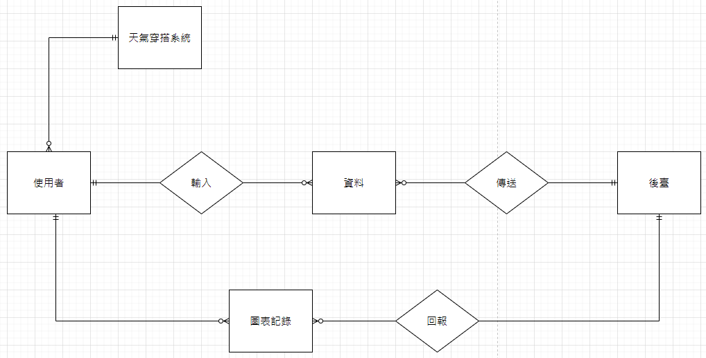
